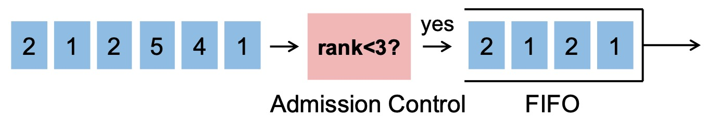

# AIFO: Programmable Packet Scheduling with a Single Queue

## 0. Introduction<br>
AIFO is a new approach to programmable packet scheduling that uses only a single queue.
AIFO computes a rank quantile for a coming packet and decides whether to admit the packet into the queue based on the rank qunatile and the queue length.



We provide a hardware prototype on Tofino and a simulation based on a packet-level simulator NetBench. 

Here we show how we implement the sliding-window-based quantile estimation (spatial component) and queue length estimation (temporal component) in the hardware prototype.
- **Quantile estimation**<br>
  The sliding window is implemented with a bunch of registers `window_x_y_register` and a pointer `tail_reg`. For each packet, we check its rank (`meta.rank`) and see if it is smaller than the value in the register:
  ```p4
  #define BLACKBOX_CHECK_WINDOW(i,j) \
    blackbox stateful_alu check_win_##i##_##j##_alu { \
        reg: window_##i##_##j##_register; \
        condition_lo: meta.rank < register_lo; \
        condition_hi: meta.tail == (i*4 + j) * SAMPLE_COUNT; \
        update_lo_1_predicate: condition_hi; \
        update_lo_1_value:     meta.rank; \
        update_hi_1_predicate: condition_lo; \
        update_hi_1_value:     1; \
        update_hi_2_predicate: not condition_lo; \
        update_hi_2_value:     0; \
        output_value:          alu_hi; \
        output_dst:            meta.count_##i##_##j##_let; \
   }
  ```

- **Queue length estimation**<br>
  The queue length is maintained by a couple of "worker packets" which are recirculated all the time. Normal packets retrieve queue length and store it into register `eg_queue_length_reg` at egress. While "worker packets" read value from `eg_queue_length_reg`, get recirculated and put the value into `ig_queue_length_reg` at ingress. In this way, normal packets can read queue length from `ig_queue_length_reg` and make admission decisions at ingress.
  Please check these Match-Action Tables:
  ```p4
  table get_ig_queue_length_table // normal packets
  table set_ig_queue_length_table // worker packets
  table get_eg_queue_length_table // worker packets
  table set_eg_queue_length_table // normal packets
  ```
More details of the design are available in our SIGCOMM'21 paper "Programmable Packet Scheduling with a Single Queue". [[Paper]](https://cs.jhu.edu/~zhuolong/papers/sigcomm21aifo.pdf)

Below we show how to configure the environment, how to run the system and how to reproduce the results.

## 1. Content<br>
- aifo_testbed/<br>
  - arp_conf/: Some configuration files for our local cluster<br>
  - aifo_switch/:<br>
    - controller/: control-plane module for AIFO.<br>
    - p4src/: data-plane module (p4 code) for AIFO.<br>
  - simple_switch/: FIFO switch code for comparison.<br>
  - sppifo/: SP-PIFO switch code for comparison (https://github.com/nsg-ethz/SP-PIFO/tree/master/p4-code).<br>  
  - host_code/:<br>
    - incast_dpdk/:<br>
      - client/: dpdk client code for udp experiments.<br>
      - server/: dpdk server code for udp experiments.<br>
    - simple_tcp/: python scripts for sending TCP traffic and measure throughput.<br>
    - worker/: python script for sending worker packets.<br>
  - results/: We collect results from all the servers and store them here.<br>
  - logs/: Used to store some logs.<br>
- aifo_simulation/: Simulation code for AIFO. Please check [here](aifo_simulation/java-code/README.md) for more details.<br>
- figs/: After we get the raw results, we can use [parse.py](parse.py) to generate figures and store them here.<br>
- config.py: Some parameters to configure.<br>
- console.py: A script to help run different set of evaluations.<br>
- parse.py: A script to parse the raw results and generate the figures.<br>
- README.md: This file.<br>

## 2. Environment requirement<br>
- Testbed experiments<br>
  - Hardware requirements<br>
    - A Barefoot Tofino switch.<br>
    - Servers with a DPDK-compatible NIC (we used an Intel XL710 for 40GbE QSFP+) and multi-core CPU, connected by the Tofino switch.<br>
      - We recommend you to configure [**password free ssh login**](https://www.google.com/search?q=password+free+ssh+login) from your endhost to the servers/switch.
  - Software requirements<br>
    The current version of AIFO is tested on:<br>
      - Tofino SDK (version after 8.9.1) on the switch.<br>
      - DPDK (16.11.1) on the servers.<br>
        You can either refer to the [official guide](https://doc.dpdk.org/guides/linux_gsg/quick_start.html) or use the tools.sh script in dpdk_code/.
        ```shell
        cd aifo_testbed/host_code/
        ./tools.sh install_dpdk
        ```
      - Linux kernel version (after 4.10.0).<br>
    We provide scripts to run the experiments and to analyze the results. To use the scripts, you need:
    - Python3 (3.7 or higher), and some libraries we used to control remote machines, process results, etc.<br>
      ```pip install paramiko matplotlib pandas palettable```
    - iperf3, for tcp experiments.<br>
      ```apt install iperf3```
- Simulations<br>
  - Please check details [here](aifo_simulation/java-code/README.md).
  
## 3. How to run and reproduce the results<br>
### 3.1 Testbed experiment results (Figure 14 & Figure 15)

We provide a script `console.py` to organize and run the switch and servers. Here we show how to run AIFO.<br>
(**Note for SIGCOMM'21 artifact evaluation process**: We can provide testbed if needed (could help skip the first step).)
1. Configure the parameters in the files based on your environment
   - `config.py`: You need to provide the information of your servers and switch (username, passwd, hostname, dir). 
     - `local_home_dir` is the current path;
     - `remote_server_home_dir` is where you want to put `aifo_testbed` at on your servers;
     - `remote_switch_home_dir` is where you want to put `aifo_testbed` at on your switch, `remote_switch_sde_dir` is the Tofino sde dir.
   - `aifo_testbed/aifo_switch/controller/ports.json`: use the information (actual enabled ports) on your switch, also configure the ips (`ipv4_table_address_list`) and ports (`ipv4_table_port_list`) in `aifo_testbed/aifo_switch/controller/test.py`
   - `aifo_testbed/simple_switch/controller_init/[ports.json|test.py]`: use the information from your local cluster.
   - `aifo_testbed/sppifo/controller_init/[ports.json|test.py]`: use the information from your local cluster.
   - Replace the PCI address (`PCI_PATH`) as the address of your DPDK NIC in `aifo_testbed/host_code/tools.sh` and `aifo_testbed/host_code/incast_dpdk/tools.sh`
2. Setup the switch
   - Setup the necessary environment variable.
   - Copy the files to the switch: `python console.py init_sync_switch`.
   - Compile AIFO: `python console.py compile_aifo`.
    It will take **a couple of minutes**. You can check `aifo_testbed/logs/p4_compile.log` in the switch to see if it's finished.
   - Compile FIFO and SP-PIFO: `python console.py compile_fifo` and `python console.py compile_sppifo`.
    They will also take **a couple of minutes**.
3. Setup the servers
   - Install dpdk.
   - Copy the files to the server: `python console.py init_sync_host`.
   - (Only for UDP experiments) Bind NIC to DPDK: `python console.py setup_dpdk`
     - Compile the UDP DPDK clients and servers: `python console.py compile_host`
   - (Only for TCP experiments) Return NIC to kernel: `python console.py unbind_dpdk`
     - After unbinding DPDK, we should also configure ip address and arp for the servers. You can refer to [this](aifo_testbed/arp_conf) which we used to configure our local cluster. (**Note for SIGCOMM'21 artifact evaluation process:** In our testbed, we can simply run `python console.py set_arp` to setup the address and arp.)
   - **Note:** We recommend to setup and bind DPDK and run all the udp experiments (Figure 14) together, and then unbind DPDK and run all the tcp experiments (Figure 15). Before and after running, you can run `python console.py kill_host` to make sure there is no client/server running.<br>
     For example, to reproduce UDP results
     ```shell
     python console.py init_sync_host
     python console.py setup_dpdk
     python console.py compile_host
     python console.py run_udp_fifo
     python console.py run_udp_sppifo
     python console.py run_udp_aifo
     python console.py kill_host
     ```
     And then you can run the following to reproduce TCP results
     ```shell
     python console.py unbind_dpdk
     python console.py set_arp
     python console.py run_tcp_fifo
     python console.py run_tcp_sppifo
     python console.py run_tcp_aifo
     python console.py kill_host
     ```
4. The following commands execute the switch program and client/server programs automatically and grab the results to your endhost.
   - Figure 14(a): `python console.py run_udp_fifo`
   - Figure 14(b): `python console.py run_udp_sppifo`
   - Figure 14(c): `python console.py run_udp_aifo`
   - Figure 15(a): `python console.py run_tcp_fifo` 
   - Figure 15(b): `python console.py run_tcp_sppifo` 
   - Figure 15(c): `python console.py run_tcp_aifo` 
5. Interpret the results.
   - `console.py` will collect raw results from the servers and store them at `results`.
   - `parse.py` can parse the results and generate the figures.
     - We can figures by running `python parse.py [udp|tcp] [fifo|sppifo|aifo]` (e.g., `python parse.py udp fifo` for Figure 14(a)). 
     - The figures will be generated at `/figs`. The figures are corresponding to the figures shown in the paper:
       - Figure 14(a): `Eval_udp_fifo.pdf` 
       - Figure 14(b): `Eval_udp_sppifo.pdf`
       - Figure 14(c): `Eval_udp_aifo.pdf` 
       - Figure 15(a): `Eval_tcp_fifo.pdf` 
       - Figure 15(b): `Eval_tcp_sppifo.pdf` 
       - Figure 15(c): `Eval_tcp_aifo.pdf` 

<!-- 7. Other commands<br>
   There are also some other commands you can use:
   - `python console.py [sync_switch|sync_host]`<br>
     Incrementally sync files to switch/servers
   - `python console.py ` -->
### 3.2 Simulation results (Figure 7~13 & Figure 16)
1. Please refer to the [instruction](aifo_simulation/java-code/README.md) to reproduce the simualtion results.
2. Interpret the results.
   - `parse.py` can also generate figures for simulation results.
   - `parse.py` simply read the results from `aifo_simulation/java-code/projects/aifo/plots/` and generate figures. To generate the Figure X(a) in the paper, simply run `python parse.py fig Xa`, (e.g., `python parse.py fig 8b` generates Figure 8(b) in the paper, `python parse.py fig 12a` generates Figure 12(a)).
   - The figures are also stored at `/figs`, simply named as Xa.pdf (e.g., 8b.pdf, 12a.pdf)
## 4. Contact<br>
Feel free to drop us an email at `zhuolong at cs dot jhu dot edu` or `chu29 at jhu dot edu` if you have any questions.

